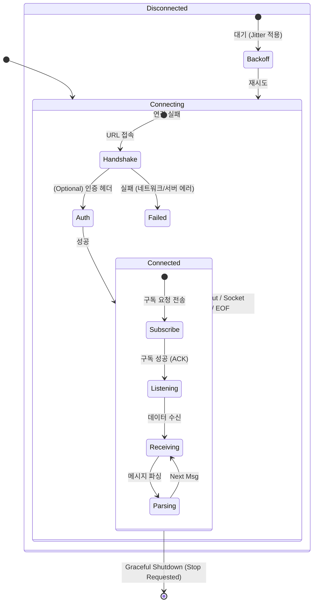

# Websocket Connection Management Strategy

## 1. 핵심 철학 (Core Philosophy)
웹소켓 연결 관리의 목표는 **"무중단 데이터 수신"**입니다. 이를 달성하기 위한 유일한 전략은 **"단순함(Simplicity)"**입니다.

- **Stateless Reconnection**: 재연결 시 복잡한 상태 복구 대신, "초기 설정값"으로 리셋하는 것을 원칙으로 합니다.
- **Fail Fast, Retry Smart**: 에러가 발생하면 즉시 연결을 끊고, 지수 백오프(Exponential Backoff)를 사용하여 시스템 부하 없이 재접속합니다.
- **Single Responsibility**: 핸들러는 "연결 유지"와 "메시지 분배"에만 집중합니다. 파싱이나 비즈니스 로직은 최대한 위임합니다.

## 2. 생명주기 다이어그램 (Lifecycle)

## 3. 구성 요소 및 역할 (Components)

### 3.1. BaseWebsocketHandler (The Anchor)
시스템의 중심입니다. 모든 상태(연결 객체, 현재 파라미터)를 보유하는 **Single Source of Truth**입니다.
- **책임**:
    - `websockets.connect()` 호출 및 세션 유지.
    - 수신 루프(`while True: recv()`) 실행.
    - 재연결 로직(무한 루프 + 에러 핸들링) 제어.
    - `SubscriptionManager` 역할을 흡수하여 직접 파라미터(`self._last_params`) 관리.

### 3.2. ConnectionErrorHandler (The Guard)
연결 과정에서 발생하는 모든 예외를 표준화된 방식으로 처리하고 로깅/보고합니다.
- **책임**:
    - 예외 타입별 로깅 레벨 조정 (ConnectionClosed=Info, Others=Error).
    - 운영자 알림(Alert) 발행 조건 판단.

### 3.3. ConnectionHealthMonitor (The Watchdog)
"연결된 것처럼 보이지만 실제로 죽은(Zombie)" 연결을 감지합니다.
- **책임**:
    - 주기적 Application-Layer Ping 전송.
    - `last_received_time` 감시 (Traffic Silence Detection).
    - 타임아웃 발생 시 능동적으로 소켓 `close()` 호출 -> 핸들러가 `Disconnected` 상태로 전이되도록 유도.

## 4. 개선 로드맵 (Refactoring Roadmap)

### Phase 1: 구조 단순화 (Simplification)
1.  **SubscriptionManager 제거**: 핸들러가 직접 초기 파라미터를 기억하고 재연결 시 재사용.
2.  **상태 통합**: 파편화된 상태 변수(`_current_ws`, `params`, `state_domain`)를 핸들러 내부로 모으기.

### Phase 2: 안정성 강화 (Robustness)
1.  **Smart Reconnect**: 인터넷 연결이 완전히 끊긴 경우 백오프를 무한히 늘리지 않고 일정 주기(예: 60초)로 설정 상한선(Cap) 적용.
2.  **Graceful Shutdown**: 종료 시그널 수신 시 처리 중인 메시지는 완료하고 소켓을 닫는 로직 보강.

### Phase 3: 가시성 확보 (Observability)
1.  **Connection Metrics**: 연결 유지 시간(Uptime), 분당 재연결 횟수 등을 메트릭으로 노출.
2.  **Logging Refine**: 연결/해제 로그를 명확한 키워드(`[CONNECTED]`, `[DISCONNECTED]`)로 표준화하여 그렙(Grep) 용이성 확보.
